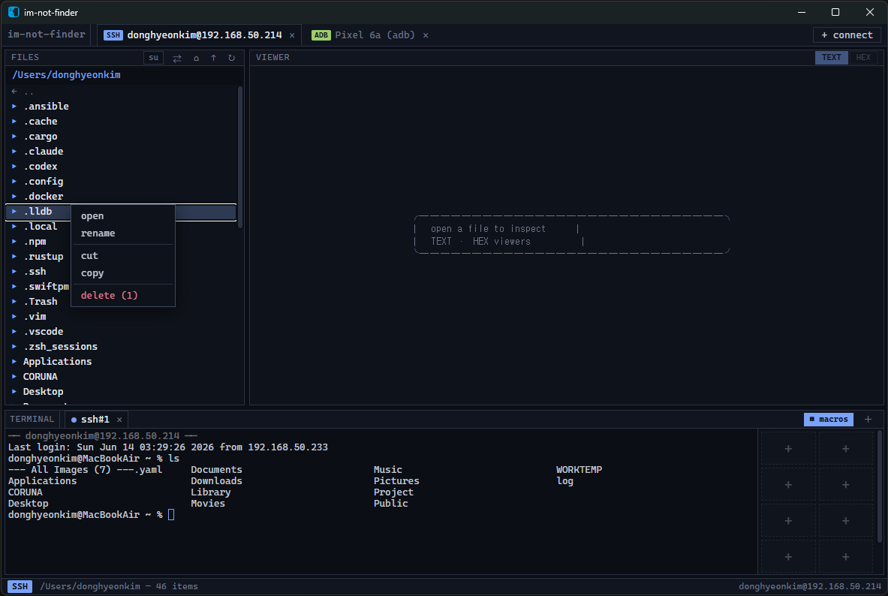

# im-not-finder

A unified **SSH + ADB workbench**: connect to a remote host (SSH/SFTP) or an Android
device (ADB) and browse files, run a terminal, inspect bytes in a hex view, and
**drag files straight out to your desktop** (auto scp/pull). It *looks* like a TUI
(monospace, single-hue dark theme, box-drawing panels) but behaves like a GUI —
hover highlights, drag & drop, resizable panels.

Built with **Tauri v2 + Rust** (cross-platform) and a plain **Svelte 5 + Vite** frontend.



## Why
SSH file managers (WinSCP, Termix…) and ADB GUIs (scrcpy, ADB File Explorer…) exist
separately. Almost nothing gives you *both* protocols in one TUI-styled UI with
drag-to-desktop transfer and a built-in hex editor. This fills that gap.

## Architecture
```
src/                       Svelte frontend (TUI look, GUI behaviour)
  components/              ConnectionBar, FileTree, Terminal, HexView, ConnectDialog, …
  lib/api.ts              typed wrappers over the Tauri command layer
  styles/theme.css        the TUI palette
src-tauri/src/
  transport/mod.rs        `Transport` trait shared by both backends
  transport/adb.rs        ADB backend (delegates to the system `adb` binary)
  transport/ssh.rs        SSH/SFTP backend (russh + russh-sftp, pure Rust)
  session.rs              live session + shell registry (Tauri managed state)
  commands.rs             #[tauri::command] bridge
```

The `Transport` trait (`list_dir`, `read_chunk`, `download`, `upload`, `exec`,
`open_shell`) is the seam that lets one UI drive both protocols.

## Prerequisites
- Rust (stable), MSVC build tools, WebView2 (bundled on Windows 11)
- Node 18+
- `adb` on PATH (only for ADB sessions). SSH needs no external binary.

## Run
```bash
npm install
npm run tauri dev      # dev with HMR
npm run tauri build    # production bundle
```

## Status (MVP skeleton)
Implemented & compiling; the app launches. End-to-end verification against a real
device/host is still pending for some paths.

| Area | State |
|------|-------|
| TUI layout, panels, splitters | implemented |
| ADB: device list, file tree, hex, terminal, pull/push | implemented |
| SSH: connect (password/key), file tree, hex, terminal, scp | implemented |
| Drag-out to desktop (stage → native drag) | implemented, needs gesture/icon polish |
| Hex view | read-only, paged (virtualisation TODO) |

### Known TODO
- Drag-out: the remote file is staged to a temp dir then handed to the OS drag;
  the gesture timing and drag icon need refinement on real hardware.
- Hex: large-file virtual scrolling; editing/writing.
- SSH host-key verification is currently trust-on-first-use (accepts any key).
- Transfer progress UI, host bookmarks, ADB `run-as`/`su` elevation.
